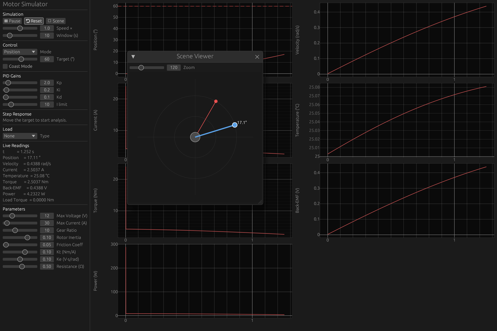

# ⚙️ DC Motor Simulator

> A real-time DC motor simulator written in Rust with an interactive GUI.



---

## Features

### 🔌 Motor Model
| Parameter | Description |
|---|---|
| Back-EMF | Modeled from rotor speed and back-EMF constant |
| Resistance & Inductance | Winding electrical characteristics |
| Gear Ratio | Torque and speed scaling between rotor and output shaft |
| Current Limiting | Clamped to max current |
| Thermal Model | Joule heating (I²R) with Newton's law of cooling |
| Coast / Brake | Open-circuit and short-circuit braking modes |

---

### 🎮 Control Modes
| Mode | Description |
|---|---|
| **Voltage** | Direct open-loop voltage command |
| **PWM** | Duty cycle (−1.0 to 1.0) mapped to voltage |
| **Position** | Closed-loop position control via PID |
| **Velocity** | Closed-loop velocity control via PID |

---

### 🏋️ Load Modes
| Mode | Description |
|---|---|
| None | Frictionless free spin |
| Constant Torque | Fixed opposing torque |
| Spring | Linear restoring torque |
| Fan / Pump | Quadratic drag |
| Pendulum | Gravitational restoring torque |

---

### 📈 Visualizer
- **Live plots** — position, velocity, current, torque, back-EMF, power, temperature
- **Step response metrics** — rise time, settling time, overshoot, steady-state error
- **2D scene** — animated load visualization driven by simulation state
- **Sidebar controls** — tune PID gains, motor parameters, sim speed, and time window in real time

---

## Building

```bash
cargo run --release
```

**Requirements:** Rust 2024 edition

---

## Dependencies

| Crate | Purpose |
|---|---|
| [eframe](https://github.com/emilk/egui/tree/master/crates/eframe) | Native GUI framework |
| [egui_plot](https://github.com/emilk/egui_plot) | Real-time plotting |
